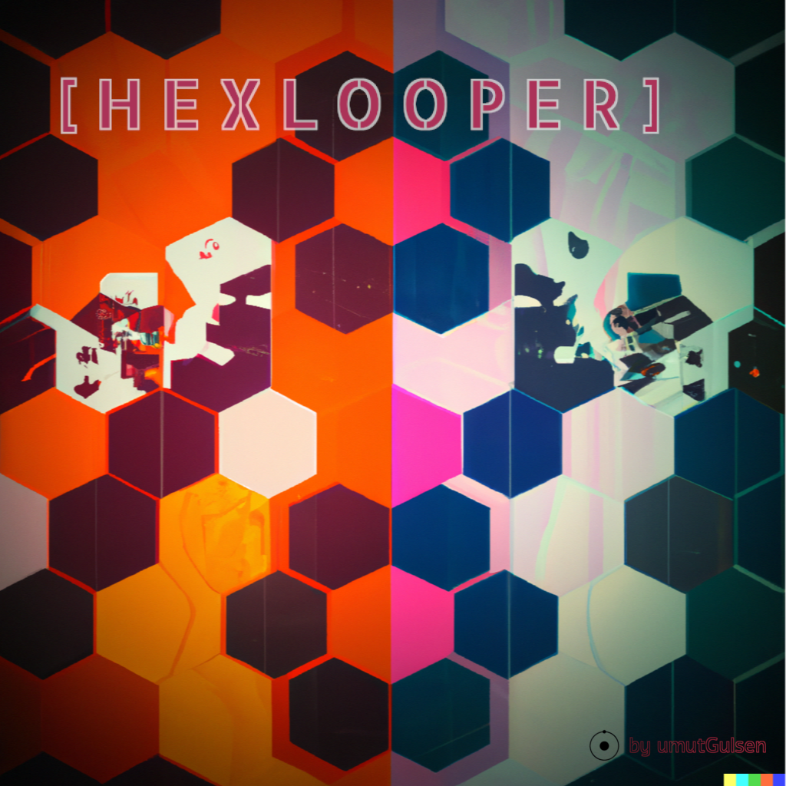

# HEXLOOPER
### A Reinforcement Learning Project

Welcome to Hexlooper!

This is a game created for AI agents to learn how to play.

Rules of the game:

 - The game environment is hexagonal grid, with an arbitrary number of players
 - Each player's starting hex is their "nest"
 - Each turn, players can move to a neigbouring hex
 - As they move, they create a "track" consisting of hexes they have travelled through
 - At each move, their "track score" increases by the length of their track (1+2+3+...)
 - Players cannot move to a hex that is included in their track (no backtracking)
 - If they somehow loop back to their nests, their track score is added to their actual score, their track and track score are cleared
 - If a player steps on the track of another player, other player's track and track score is cleared and their current hex becomes their new nest
 - Player with the highest score wins!

## Current implemented features:
 - Playable game with a custom board and player number
 - Learning with Genetic Algorithm
 - Learning with Random Neural Networks
 - Optimization of learning algorithms with Optuna

## Aspirations:
 - Higher performance
 - NEAT algorithm
 - Q-Learning implementation
 - Network visualization